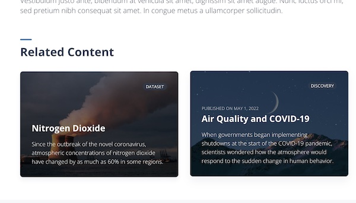
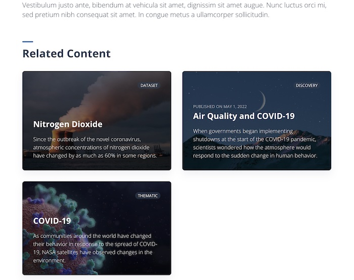

📇 **Shortcuts:**

- Check the [MDX_BLOCK.md](./MDX_BLOCKS.md) for information on the different blocks that can be used to compose the content layout.
- Check [layer.md](./frontmatter/layer.md) for details on the different properties of a dataset layer.
- Check [media.md](./frontmatter/media.md) for information on the images needed for the content's covers.

----

# Content

- [Content](#content)
  - [Thematic Areas](#thematic-areas)
  - [Datasets](#datasets)
  - [Discoveries](#discoveries)

Delta consists of Thematic Areas, Datasets, and Discoveries. Each dataset and discovery belongs to a thematic area (or multiple thematic areas), and discovery can use datasets. When you are adding contents using published datasets in Delta, you would need to know which thematic area it belongs to, and if you need to create a new thematic area.

Each piece of content is written in [MDX](https://mdxjs.com/docs/what-is-mdx/#what-is-mdx) with configuration frontmatter. Frontmatter is separate by a set of `---` from MDX content.  

A file will look something like:
```yml
---
id: theme1
name: Thematic area 1
---

<Block>
  <Prose>
    ## About thematic area

    Once upon a time there was a content string
  </Prose>
</Block>
```

There are different types of `Block` components that can be used to create engaging content pieces.  
Each `Block` comes with its own rules and needed props, so check the [MDX_BLOCK.md](./MDX_BLOCKS.md) for the full details.

## Thematic Areas

Frontmatter configuration for the Thematic Area

```yaml
id: string
name: string
description: string
media: Media

about:
  title: string
  description: string
```

**id**  
`string`  
Id of this thematic area. Must be unique in the whole application.

**name**  
`string`  
Name of this thematic area. This is used to reference to this thematic area in the application.

**description**  
`string`  
Brief description of this thematic area. This is displayed on cards and the header of a thematic area.

**usage**
`object`
Link to examples for how to use this dataset.

**usage.url**
`string`
URL for example on how to use this dataset.

**usage.title**
`string`
Title of the page linked to for an example of how to use this dataset.

**media**  
`Media`  
Image to identify this resource. See [media.md](./frontmatter/media.md).

**about**  
`object`  
Information for the Thematic area about page.

**about.title**  
`string`  
Title for the about page.

**about.description**  
`string`  
Description for the about page.

MDX content for thematic areas will show up under /about page. For example, `air-quality` thematic area's MDX contents will show up under `/air-quality/about`.

## Datasets

Frontmatter configuration for the Dataset
```yaml
---
id: string
name: string
description: string
media: Media

thematics: string[]
featuredOn: string[]

layers: Layer[]
related: Related[]
  - type: string
    id: string
    thematic: string
---

<Block>
  <Prose>
    ## This is a Dataset

    Once upon a time there was a content string
  </Prose>
</Block>
```

**id**  
`string`  
Id of this dataset. Must be unique in the whole application

**name**  
`string`  
Name of this dataset. This is used to reference to this dataset in the application.

**description**  
`string`  
Brief description of this dataset. This is displayed on cards and the header of a dataset.

**media**  
`Media`  
Image to identify this resource. See [media.md](./frontmatter/media.md).

**thematics**  
`string[]`  
List of thematic areas ids this discovery belongs to. These values are used by the application to establish a relationship between thematic areas and discoveries.  
Example:
```yaml
thematics:
  - covid-19
  - agriculture
```

**featuredOn**  
`string[]`  
List of thematic areas ids where this discovery is featured. A featured discovery will show up in the thematic area homepage.  
Example:
```yaml
featuredOn:
  - covid-19
  - agriculture
```


**layers**  
`Layer[]`  
List of layers for this dataset. See [layer.md](./frontmatter/layer.md).  
Example:
```yaml
layers:
  - id: layerId
    ... # more props
  - id: anotherLayerId
    ... # more props
```
MDX content for datasets will show up under /overview page. For example, `no2` dataset MDX accessed from `air-quality` thematic area will show up under `/air-quality/datasets/no2`.

**related**  
`Related[]`  
List of related contents. This list will be displayed at the bottom of dataset overview like below.  
(The screenshot shows the case when there are 2 related content entries.)



Each content should be formatted like below. 

```yaml
  # when related content is dataset
  - type: dataset
    id: dataset-id
    thematic: thematic-dataset-belongs
  # when related content is discovery
  - type: discovery
    id: discovery-id
    thematic: thematic-discovery-belongs
  # when related content is thematic (doesn't need thematic attribute)
  - type: thematic
    id: thematic-id
```

## Discoveries

Frontmatter configuration for the Discovery
```yaml
---
id: string
name: string
description: string
media: Media
pubDate: string

thematics: string[]
featuredOn: string[]

related: Related[]
  - type: string
    id: string
    thematic: string
---

<Block>
  <Prose>
    ## This is a discovery

    Once upon a time there was a content string
  </Prose>
</Block>
```

**id**  
`string`  
Id of this discovery. Must be unique in the whole application.

**name**  
`string`  
Name of this discovery. This is used to reference to this discovery in the application.

**description**  
`string`  
Brief description of this discovery. This is displayed on cards and the header of a discovery.

**media**  
`Media`  
Image to identify this resource. See [media.md](./frontmatter/media.md).

**pubDate**  
`string`  
Publication date for this discovery. Should be in YYYY-MM-DD format.

**thematics**  
`string[]`  
List of thematic areas ids this discovery belongs to. These values are used by the application to establish a relationship between thematic areas and discoveries.  
Example:
```yaml
thematics:
  - covid-19
  - agriculture
```

**featuredOn**  
`string[]`  
List of thematic areas ids where this discovery is featured. A featured discovery will show up in the thematic area homepage.  
Example:
```yaml
featuredOn:
  - covid-19
  - agriculture
```


MDX content for discovery will show up under its own page under `:thematic-area/discoveries/:discovery-id`. For example, `air-quality-and-covid-19` discovery, which belongs to `air-quality` thematic area will show up under `/air-quality/discoveries/air-quality-and-covid-19`

**related**  
`Related[]`  
List of related contents. This list will be displayed at the bottom of discovery page like below.  
(The example shows the case when there are 3 related content entries.)



Each content should be formatted like below

```yaml
  # when related content is dataset
  - type: dataset
    id: dataset-id
    thematic: thematic-dataset-belongs
  # when related content is discovery
  - type: discovery
    id: discovery-id
    thematic: thematic-discovery-belongs
  # when related content is thematic (doesn't need thematic attribute)
  - type: thematic
    id: thematic-id
```
