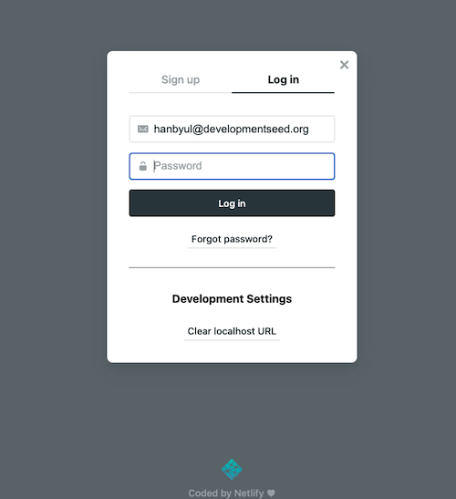
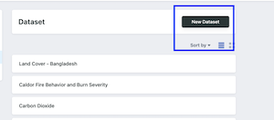
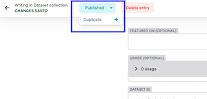
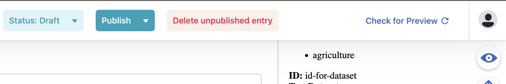
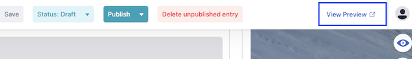
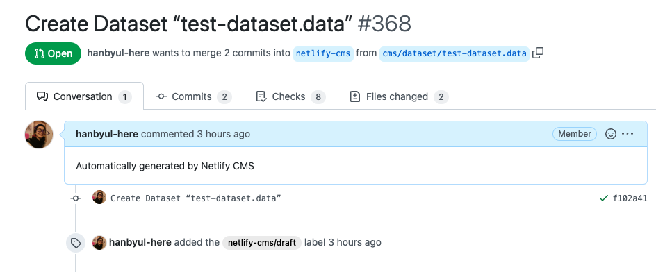
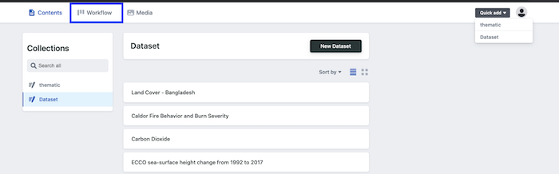
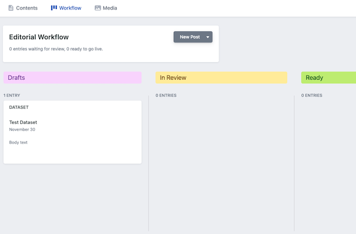
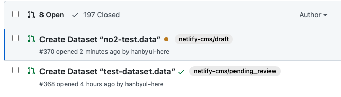

## How to use Netlify CMS with Veda dashboard
### Sign up

You can access to Veda dashboard configuration editor at https://visex.netlify.app/admin/index.html. You should be able to see a prompt like the one below if it is your first time.

Follow the steps on the page to sign up as a user for CMS.

### Configure dataset 

Click on New Dataset, or you can duplicate the existing dataset through left-top toolbar. 

Currently, all fields in the configuration editor must be filled out for the dataset to appear properly in the VEDA Dashboard, including optional fields like thematics.

### 'Save' with preview

Once you 'save' your dataset, the cofiguration editor will show 'Check for preview' button on the top right corner of the page.

The button will change its text to 'View preview' once the preview is ready as you click upon it. This can take upwards of a few minutes. If you continue to click 'Check for Preview' then it should change once a preview exists. You can click on the button to see your change on preview page. 

Currently, when you are updating your post, the button will continue to say 'View preview.' However, there is still a small time delay. If your most recent change does not appear, give it a few minutes and it should show up.

#### Behind the scene

Think of configuration UI (Netlify CMS) as a thin wrapper on top of Git flow. When you are saving a new dataset, what the configuration editor is doing is creating a new branch with your changes. This generates a preview. By Publishing through the editor, you are essentially merging your branch into the main branch. The editor allows you to create, edit, and merge a branch without ever having to go to Github. Once created, you also have the ability to go to github and treat it like any other branch.

### Where can I find the post that I (or my collaborator) saved?

On main dashboard view, you will find 'workflow' tab on top left.

You can find the posts generated through Netlify CMS on this page. 

Moving the post through columns will change the label of the pr. For example, two prs below were generated through Netlify CMS. `Create test-dataset.data` is in 'review' column while `Create no2-test.data` is in 'draft' column. You do not have to use this workflow, but it is there if you want to signal your collaborator about where your post is.

### Publish 
To publish the dataset you are working to the [staging Dashboard](https://visex.netlify.app/), you have two options.
1. You can go directly to the github repo NASA-IMPACT/veda-config, merge the pull request (PR) created for your branch.
2. Click the 'publish' button through the editor UI. 

We recommend using the first method since the current version of CMS still requires some manual edits. In the future, the Publish funcitonality through the configuration editor will be improved.

### Caveats

Some manual edits to mdx file are needed after the file is generated through Netlify CMS.

- `media.src` : `::file` need to be put as prefix for the path.
- `legend.color` for `categorical` type legend : Current CMS UI only supports `gradient` type legend. If you are using categorical legend, you need to edit mdx directly.
- body text: Mind that Configuration UI doesn't support the body text of dataset (used for about page).

## How to test Netlify CMS on local

1. Uncomment `local_backend` of config.yml (This will make netlify-cms to generate output locally.)
2. run `yarn` to install dependencies if you haven't.
3. run `yarn cms` to power netlify cms proxy server.
4. Open a new tab, run `yarn serve`.

* All the steps above are to generate files locally. If you don't need that, you can skip directly to 5.

5. go to https://localhost:9000/admin/index.html
6. If the login button prompts the url to put, use the netlify app url : https://visex.netlify.app. Follow the instruction to set up your account